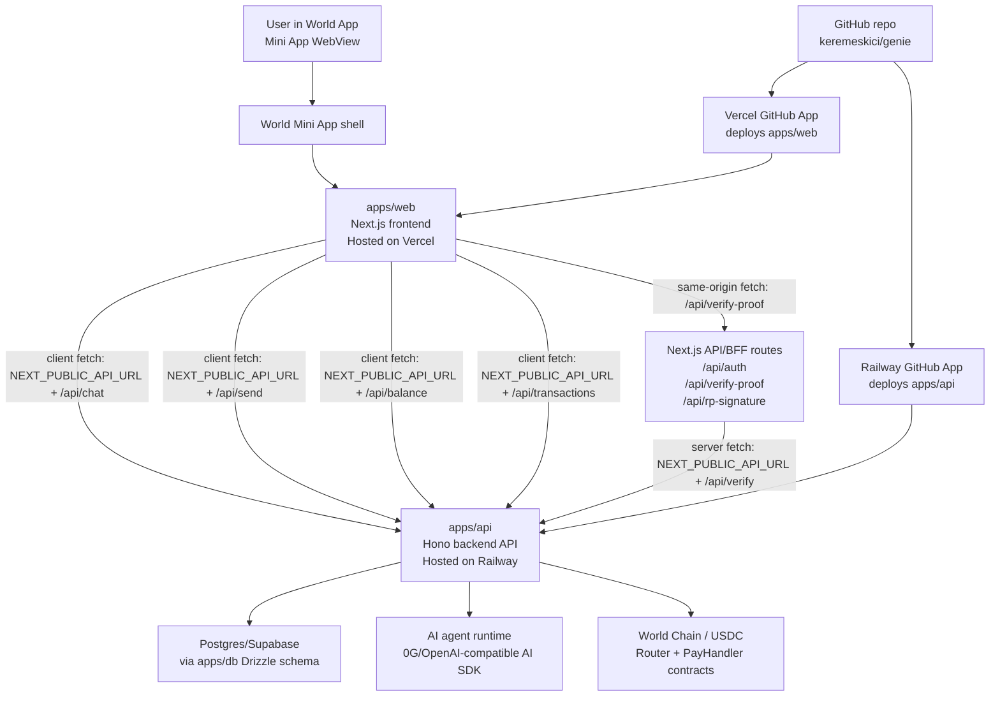
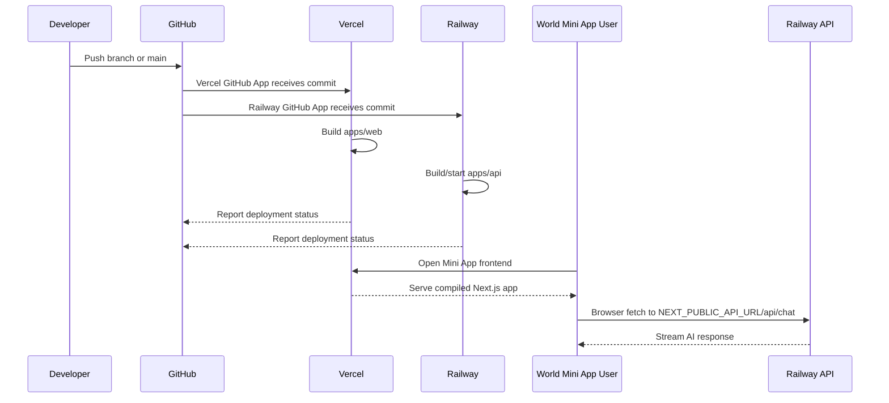

# Genie Deployment Architecture

This document explains how the Genie World Mini App frontend connects to the backend API, what Vercel and Railway are doing, and where to look when a production issue happens.

## Short Version

Genie is a monorepo with separate apps:

- `apps/web`: Next.js frontend for the World Mini App. Deployed on Vercel.
- `apps/api`: Hono/Node backend API. Deployed on Railway.
- `apps/db`: Drizzle schema and database package used by the API.
- `apps/contracts`: Solidity contracts and Foundry tests.

The frontend does not run the AI agent itself. It calls the backend API using `NEXT_PUBLIC_API_URL`.

Current local frontend env points to:

```txt
NEXT_PUBLIC_API_URL=https://genie-production-1171.up.railway.app
```

So a frontend chat request goes to:

```txt
https://genie-production-1171.up.railway.app/api/chat
```

## Deployment Diagram



## What Vercel Does

Vercel hosts the frontend app in `apps/web`.

The frontend is the site that World loads inside the Mini App webview. It renders the chat UI, onboarding, verification UI, dashboard, send modal, and other user-facing screens.

Vercel is connected to the GitHub repo through the Vercel GitHub App. When `main` is pushed, Vercel deploys production. When a feature branch is pushed, Vercel can deploy a preview.

Important: `NEXT_PUBLIC_*` variables are compiled into the browser bundle at build time. If `NEXT_PUBLIC_API_URL` changes in Vercel settings, the frontend must be redeployed before users see the new value.

## What Railway Does

Railway hosts the backend API in `apps/api`.

The backend handles:

- `/api/chat`: streams AI responses and tool calls.
- `/api/send`: creates or executes payment flows.
- `/api/confirm`: confirms pending transactions.
- `/api/balance`: reads USDC balance.
- `/api/transactions`: returns transaction history.
- `/api/users/*`: provisions users and updates profile settings.
- `/api/verify`: stores verified World ID state after the web BFF verifies proof.
- `/api/version`: returns basic deployment metadata.

Railway is also connected to the GitHub repo. When `main` is pushed, Railway deploys the API service.

Current public API host:

```txt
https://genie-production-1171.up.railway.app
```

## How The Frontend Chooses The Backend URL

The frontend uses `process.env.NEXT_PUBLIC_API_URL` in these places:

- `apps/web/src/components/ChatInterface/index.tsx`
- `apps/web/src/auth/index.ts`
- `apps/web/src/hooks/useBalance.ts`
- `apps/web/src/hooks/useTransactions.ts`
- `apps/web/src/components/SendModal/index.tsx`
- `apps/web/src/components/ConfirmCard/index.tsx`
- `apps/web/src/components/ProfileInterface/index.tsx`
- `apps/web/src/app/onboarding/page.tsx`
- `apps/web/src/app/api/verify-proof/route.ts`

Example from chat:

```ts
const API_URL = process.env.NEXT_PUBLIC_API_URL ?? '';

new DefaultChatTransport({
  api: `${API_URL}/api/chat`,
});
```

If `NEXT_PUBLIC_API_URL` is:

```txt
https://genie-production-1171.up.railway.app
```

then chat uses:

```txt
https://genie-production-1171.up.railway.app/api/chat
```

If `NEXT_PUBLIC_API_URL` is empty, browser-side calls fall back to same-origin URLs like `/api/chat`. That would hit Vercel, not Railway, and is usually wrong for this deployment because the real backend lives on Railway.

## Same-Origin Web Routes vs Backend API Routes

There are two kinds of `/api/...` routes:

### Vercel / Next.js BFF Routes

These live under `apps/web/src/app/api`.

Examples:

- `/api/verify-proof`
- `/api/rp-signature`
- `/api/initiate-payment`
- `/api/auth/*`

They run on Vercel as part of the Next.js app. They are used when the frontend needs a small server-side helper.

### Railway Backend Routes

These live under `apps/api/src/routes`.

Examples:

- `/api/chat`
- `/api/send`
- `/api/confirm`
- `/api/balance`
- `/api/users/provision`
- `/api/verify`
- `/api/version`

They run on Railway. Browser calls reach them by prefixing with `NEXT_PUBLIC_API_URL`.

## Deployment Flow



## Current Production URLs

Frontend on Vercel:

```txt
https://vercel.com/kerems-projects-92b9c9df/genie-web
```

Backend on Railway:

```txt
https://genie-production-1171.up.railway.app
```

Backend version endpoint:

```txt
https://genie-production-1171.up.railway.app/api/version
```

GitHub deployment status can also be checked from the repo commit checks. Vercel reports a `Vercel` status. Railway reports a `natural-clarity - genie` status.

## How To Check Logs

### Frontend Logs

Use Vercel logs for:

- Next.js server routes under `apps/web/src/app/api`.
- Auth callback issues.
- World ID proof BFF issues.
- Frontend deployment/build failures.

Look in the Vercel project:

```txt
genie-web
```

### Backend Logs

Use Railway logs for:

- `/api/chat` requests.
- AI model calls.
- Tool execution.
- DB errors.
- Payment and chain errors.
- Backend env var errors.

The most useful backend log prefixes are:

```txt
[route:chat]
[agent]
[route:send]
[route:confirm]
[route:verify]
[route:users]
```

If Railway dashboard links return 404, the likely cause is that your Railway account is not a member of the project/workspace. The public API can still be live even when the dashboard is inaccessible.

## Quick Debug Commands

Check the deployed backend is responding:

```bash
curl -i https://genie-production-1171.up.railway.app/api/version
```

Check that chat reaches the backend:

```bash
curl -i https://genie-production-1171.up.railway.app/api/chat \
  -H 'Content-Type: application/json' \
  -d '{"messages":[{"role":"user","content":"send $5 to 0x1234567890123456789012345678901234567890"}]}'
```

Check GitHub deployment status for `main`:

```bash
gh api repos/keremeskici/genie/commits/main/status \
  --jq '{sha: .sha, state: .state, statuses: [.statuses[] | {context: .context, state: .state, target_url: .target_url, description: .description}]}'
```

## Common Failure Modes

### Frontend points at the wrong API

Symptom:

- Chat UI loads, but backend changes do not seem to apply.
- `/api/version` on Railway has the new endpoint, but frontend behavior looks old.

Check:

```txt
NEXT_PUBLIC_API_URL
```

in Vercel environment variables for the frontend project.

### Preview frontend points at production backend

Symptom:

- Vercel preview deploy exists, but it still calls Railway production.

Cause:

- Preview builds use the Preview value of `NEXT_PUBLIC_API_URL`.
- If that value is the Railway production URL, preview frontend still uses production API.

Fix:

- Set Vercel Preview `NEXT_PUBLIC_API_URL` to the desired preview API URL.
- Redeploy the preview.

### Browser fallback accidentally hits Vercel

Symptom:

- Frontend calls `/api/chat` on the same domain.
- Vercel returns 404 or an unrelated route response.

Cause:

- `NEXT_PUBLIC_API_URL` is unset or empty.

Fix:

- Set `NEXT_PUBLIC_API_URL` in Vercel and redeploy.

### Railway dashboard returns 404

Symptom:

- The public API works, but Railway project links return 404.

Likely cause:

- Logged into a Railway account without access to that project.

Fix:

- Ask the Railway project owner to invite your Railway account to the workspace/project.

## Mental Model

Think of the project as two deployed services:

```txt
World Mini App user
  -> Vercel frontend (apps/web)
  -> Railway backend API (apps/api)
  -> DB / AI model / chain
```

Vercel and Railway are not the same host. They are both connected to GitHub, but they deploy different parts of the monorepo.
