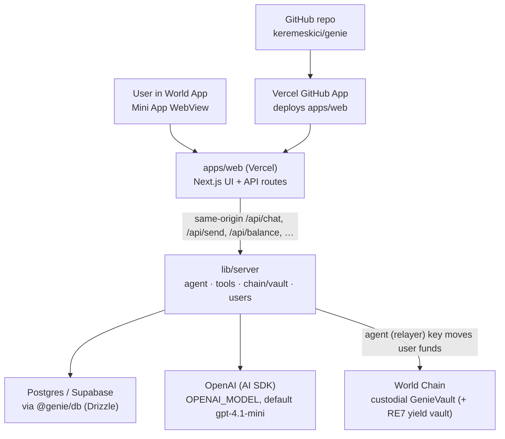

# Genie Deployment Architecture

This document explains how the Genie World Mini App is deployed and where to look when a
production issue happens.

## Short Version

Genie is a single Vercel deployment. There is no separate backend service (Railway is gone).

The monorepo packages are:

- `apps/web`: Next.js app for the World Mini App. **Hosts the UI _and_ all API routes.**
  Deployed on Vercel.
  - `apps/web/src/lib/server/`: the agent, tools, chain (vault), config — the former backend
    logic, now imported directly by the route handlers.
  - `apps/web/src/app/api/`: native Next.js route handlers (`/api/chat`, `/api/send`, …).
- `apps/db`: Drizzle schema + Postgres/Supabase client (`@genie/db` workspace package).
- `apps/contracts`: Solidity contracts + Foundry tests (custodial `GenieVault`).

Every `/api/...` endpoint is **same-origin** — the browser calls relative paths like
`/api/chat`. There is no `NEXT_PUBLIC_API_URL` / `BACKEND_API_URL` anymore.

## Deployment Diagram



## What Vercel Does

Vercel hosts the entire app in `apps/web`:

- The Mini App UI (chat, onboarding, verification, dashboard, send modal).
- The Next.js **route handlers** under `apps/web/src/app/api`, which run as Node serverless
  functions (`export const runtime = 'nodejs'`):
  - `/api/chat` — streams AI responses + tool calls (`maxDuration = 60`).
  - `/api/send`, `/api/confirm` — custodial sends (the agent executes on-chain; no wallet popup).
  - `/api/balance` — reads the user's managed vault balance (and wallet USDC).
  - `/api/transactions`, `/api/debts` — history reads.
  - `/api/users/provision`, `/api/users/profile` — provisioning + spending-limit sync.
  - `/api/verify` — stores verified World ID state (also called directly by `/api/verify-proof`).
  - `/api/version` — deployment metadata.
  - `/api/auth/*`, `/api/verify-proof`, `/api/rp-signature`, `/api/initiate-payment` — the
    pre-existing World/auth BFF routes.

Vercel is connected to GitHub through the Vercel GitHub App. Push `main` → production deploy;
push a branch → preview deploy.

### Vercel project setup

- **Root Directory**: `apps/web` (monorepo). `outputFileTracingRoot` is set to the repo root so
  the `@genie/db` workspace package is traced into the serverless bundle; `transpilePackages`
  includes `@genie/db`.
- Configure all server env (`OPENAI_API_KEY`, `DATABASE_URL`, `RELAYER_PRIVATE_KEY`, `WORLD_*`,
  `GENIE_VAULT_ADDRESS`, `YIELD_VAULT_ADDRESS`, `USDC_ADDRESS_*`) plus the `NEXT_PUBLIC_*` vars in
  the single Vercel project. See `.env.example`.

## Same-Origin API

All `/api/...` routes are served by the same Next.js app, so the browser uses relative paths.
The helpers in `apps/web/src/lib/backend-url.ts` (`getPublicApiUrl`, `getPublicApiBaseUrl`)
return same-origin paths. Server-side callers (`auth`, `verify-proof`) call the shared logic in
`lib/server/users.ts` directly instead of doing an HTTP round-trip.

## Custodial vault model

Funds live in a custodial `GenieVault` on World Chain. The user funds it once (USDC approve +
`vault.deposit`); the deposited balance earns yield (the vault routes into the RE7 ERC-4626 vault)
and the **agent (relayer) key** moves funds on the user's behalf with no per-transfer signature,
up to each user's on-chain `spendingLimit`. Users can always self-withdraw. `RELAYER_PRIVATE_KEY`
is the agent key — keep it secret. ⚠️ Demo/hackathon-grade, not audited.

## How To Check Logs

Use Vercel logs (single project) for everything: UI/build issues, auth/World ID BFF, AI model
calls, tool execution, DB errors, and chain/vault errors. Useful log prefixes:

```txt
[route:chat]   [agent]      [route:send]    [route:confirm]
[route:verify] [route:users] [users]        [tool:send_usdc]
```

## Quick Debug Commands

Same-origin against a deployment (replace the host):

```bash
curl -i https://<your-vercel-domain>/api/version

curl -i https://<your-vercel-domain>/api/chat \
  -H 'Content-Type: application/json' \
  -d '{"messages":[{"role":"user","content":"send $5 to 0x1234567890123456789012345678901234567890"}]}'
```

Check GitHub deployment status for `main`:

```bash
gh api repos/keremeskici/genie/commits/main/status \
  --jq '{sha: .sha, state: .state, statuses: [.statuses[] | {context, state, target_url, description}]}'
```

## Mental Model

```txt
World Mini App user
  -> Vercel (apps/web): Next.js UI + /api/* route handlers (lib/server)
  -> DB (Supabase) / OpenAI / World Chain (GenieVault)
```

One service, one origin. The agent runs inside the Next.js serverless functions; there is no
separate backend host.
